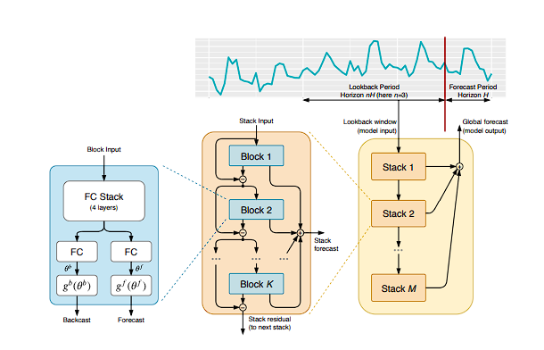
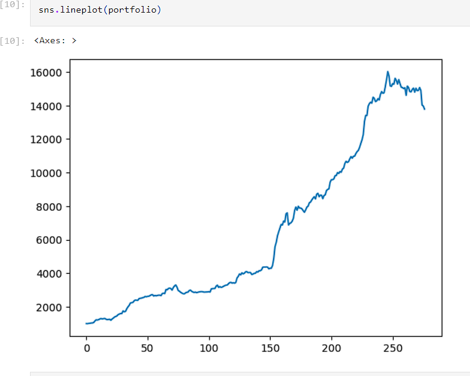
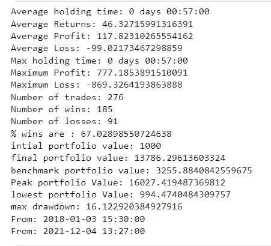

#  Signal Generation using NBEATS OHLCV Close Price Prediction 

## Overview

This repository hosts an advanced implementation of the N-BEATS algorithm for predicting stock close prices using Open-High-Low-Close-Volume (OHLCV) data from 2018 to 2022. Leveraging N-BEATS' robust capabilities in time series forecasting, this project focuses on the financial market to predict closing prices and generate trading signals.

## Features

- **N-BEATS Algorithm**: Utilizes the cutting-edge N-BEATS model for time series forecasting.
- 
- **OHLCV Data (2018-2022)**: Processes extensive historical OHLCV data for accurate model training and evaluation.
- **Close Price Prediction**: Aims at predicting the crucial closing prices in stock markets by using rolling windows.
- **Signal Generation**: Generates trading signals based on predictive analytics.
- **Data Preprocessing**: Implements comprehensive preprocessing steps for optimal model performance.
- **Model Training and Evaluation**: Provides a systematic approach to train and evaluate the forecasting model.
- **Visualization Tools**: Includes visualization tools for comparing predictions with actual market data.

## Getting Started

### Prerequisites

- Python 3.6 or later
- Required Libraries: numpy, pandas, matplotlib, tensorflow/pytorch, keras (for TensorFlow)
### Results

The project includes an in-depth analysis with visualizations of the strategy's performance, comparing it to the buy and hold benchmark. The strategy has shown remarkable success, yielding large returns — up to 13 times the initial investment. This exceptional performance demonstrates the potential of the implemented clustering and portfolio optimization techniques in algorithmic trading. 

While predicting pseudo future in time series presents its challenges, notably some degree of overfitting, these hurdles have been addressed with careful data handling and model tuning. The initial results are promising and indicate strong potential for further development into a market-ready product. Our approach demonstrates not just the feasibility but also the efficacy of advanced algorithmic trading strategies in today's dynamic markets.

